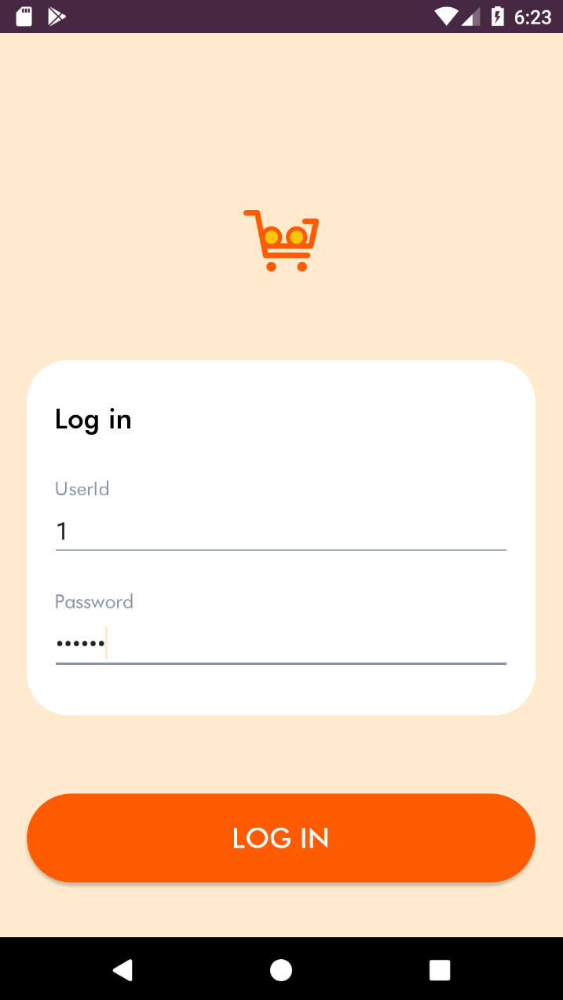
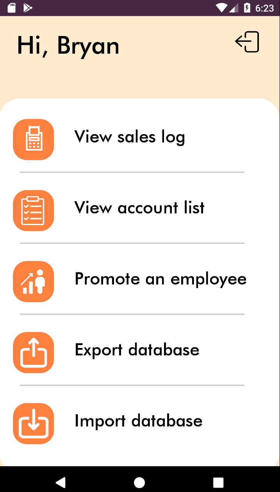
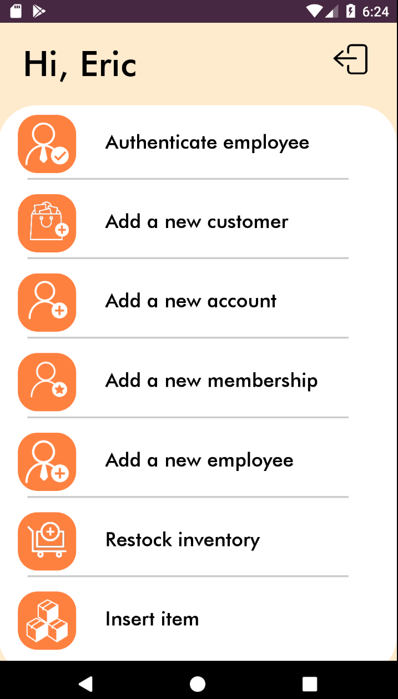
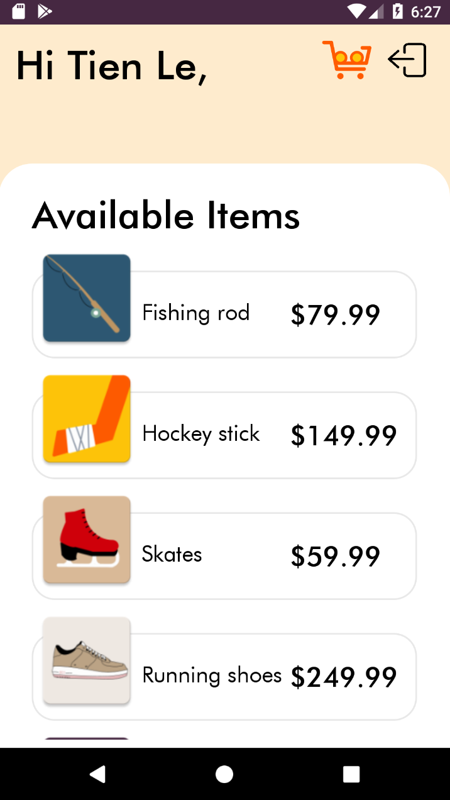
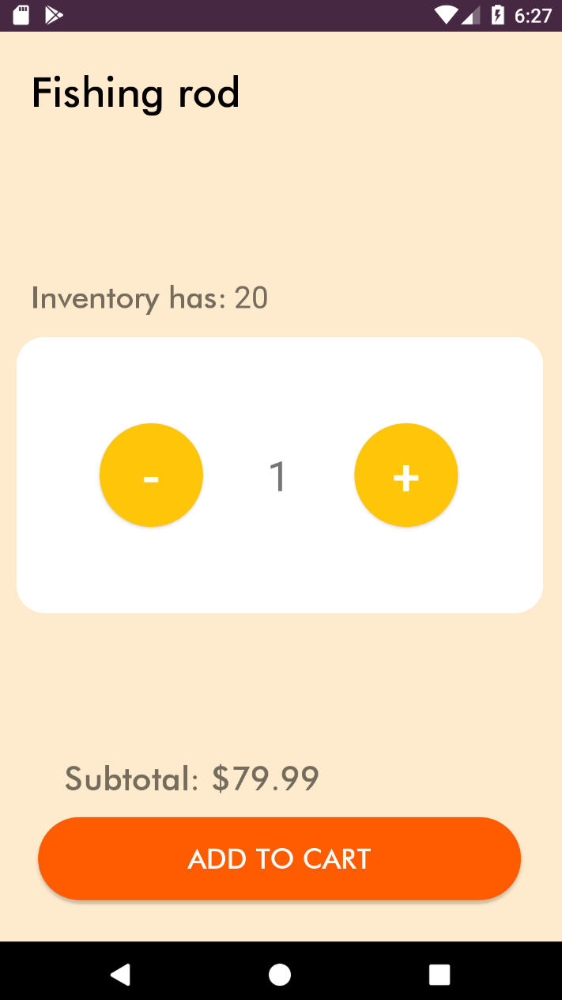
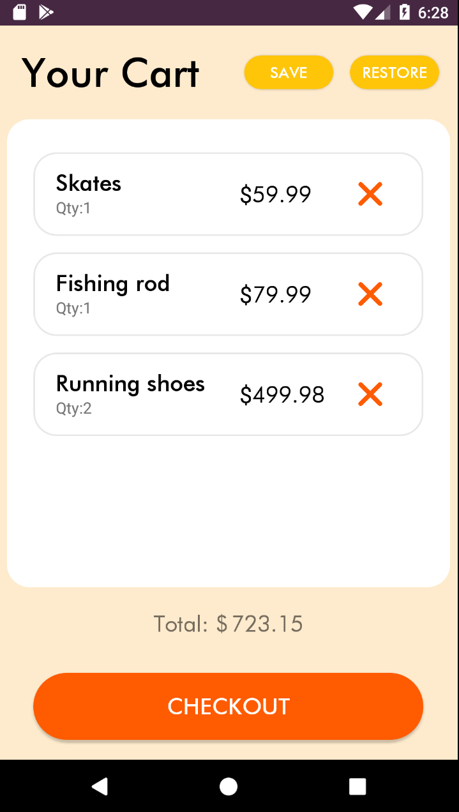

# OnlineShoppingDemo
Hey, this is a demo app for online shopping service, that has a lot of similar functionalities, such as making purchases, 
appointing employees, checking sales logs and even more! :)

## Installing
1. Download this project from the repository
2. Import the Project into Android Studio
3. Run on your emulator of choice (optimized for Nexus 2)

## Built with
* [SOLID](https://en.wikipedia.org/wiki/SOLID) - Principles, that I used to design this project
* [SDLC](https://en.wikipedia.org/wiki/Systems_development_life_cycle) - System, that I used to plan development for this project

## Demo
### Gifs
Checking out |  Making a new customer | Making a return 
:-------------------------:|:-------------------------:|:-------------------------:
  |   | 

### Screencaps
Login |  Admin | Employee
:-------------------------:|:-------------------------:|:-------------------------:
  |   | 
**Customer** |  **Item** | **Cart**
  |   | 

## License
This project is licensed under the MIT License - see the 
[LICENSE.md](https://github.com/erkhabibullina/OnlineShoppingDemo/blob/master/LICENSE) file for details

